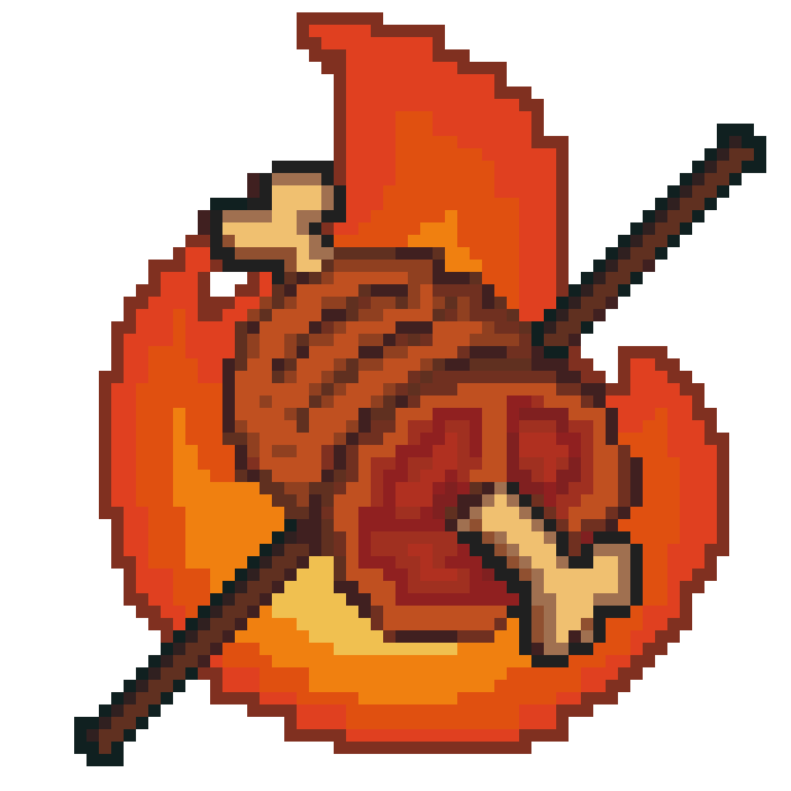

# Joseonjok Bulgogi 🔥
*_It's a framework, not actual meat._*

---

[中文](README.zh.md) | [English](README.md) | [우리말](README.ko.md)

## 🍖 Who We Are

The organization **Joseonjok Bulgogi** is not food — it's a developer collective.  
Even though we're called **bulgogi-framework**, we're serving code, not barbecue.

We're C++ developers who built a simple web framework on top of **Boost.Beast**,  
wrapped it up nicely, and then, with a touch of bad taste,  
decided to call it **bulgogi** (the `"beast"` is **fine-grilled**).

## 🍢 What We Do

We build:
- A lightweight, modern **C++ web framework**
- Inspired by Flask/Django's routing style
- Built on top of `boost::beast`, but much lighter to use
- Focused on simplicity, clarity, and rapid development

## 🔥 Why "Bulgogi"?

Because:
- The creator of the project is **Joseonjok** (an ethnic Korean in China);
- Bulgogi is a symbol of control, flavor, and fire — just like high-performance C++;
- And frankly, "bulgogi-framework" sounds more fun than "beast-router-wrapper-v2".

## 🧱 What's Next

We're actively working on:
- [`bulgogi`](https://github.com/bulgogi-framework/bulgogi) : the main framework
- Examples and quick-start templates
- Developer tools and CLI support
- Friendly docs that make Boost C++ web dev feel... less raw

---

> Fork it. Star it. Roast it. Or contribute your own flavor.

  

**👉 Not BBQ. A framework. Seriously.**
