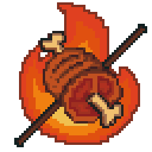

## 🧑‍🍳 친구 여러분, 안녕하십니까?

### 🥢 우리 불고기집에 오신 걸 환영합니다!

---

[Back to README](README.md)

## **아니요, 아니요, 농담입니다.**

하지만 들어오세요.  
🍺 맥주는 제공하지 않지만 **"불고기"** 는 있습니다.

🍖 **"불고기"([`bulgogi`](https://github.com/bulgogi-framework/bulgogi))** 는 실제로 C++ Web Framework 입니다.  
🔥 Boost.Beast 기반이며,  
"Beast를 구워서 불고기를 만든다"는 생각가 좀 재미있었습니다. 🥳

---

## 📦 이게 뭔데요?

"Framework" 사용을 위한 organization의 [`bulgogi`](https://github.com/bulgogi-framework/bulgogi) 저장소(repo)에 오신 걸 환영합니다.  
간단하고, 가볍고, Flask/Django Style의 "Routing"을 지원합니다.

불고기를 먹는 것만큼이나 간단합니다! 🍻

  

> 고기는 없습니다.  
> 하지만 Code, 불, 열정은 있습니다.  
> 같이 한번 구워볼까요?

🔥 개발도 불판 위에서 시작됩니다.