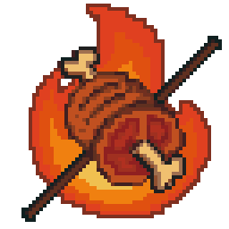

## 🍖 关于我们（中文）

[Back to README](README.md)

**Joseonjok Bulgogi（朝鲜族烤肉）** 不是烧烤店，而是一个 C++ 开发框架组织。  
我们的正式名称是 **bulgogi-framework**，  
主项目是基于 Boost.Beast 开发的 C++ Web 框架 —— `bulgogi`，  
灵感来自 Flask 和 Django，致力于打造一个简单、轻量、易用的现代 C++ Web 应用开发框架。

为什么叫 "Bulgogi"？  
因为项目作者是朝鲜族，觉得"把 Beast 烤一烤"听起来就很带劲。  
写 C++ 就像烤肉：要掌控火候，要精准出手，也要有点热情。

  

*为什么图标是一只火烤的大肘子？*  
因为它视觉冲击力够强，而且 `불고기`（bulgogi）字面上就是：**🔥 + 🍖**

> 我们不卖烤肉，但我们写框架。欢迎来一起"翻烤" C++！
